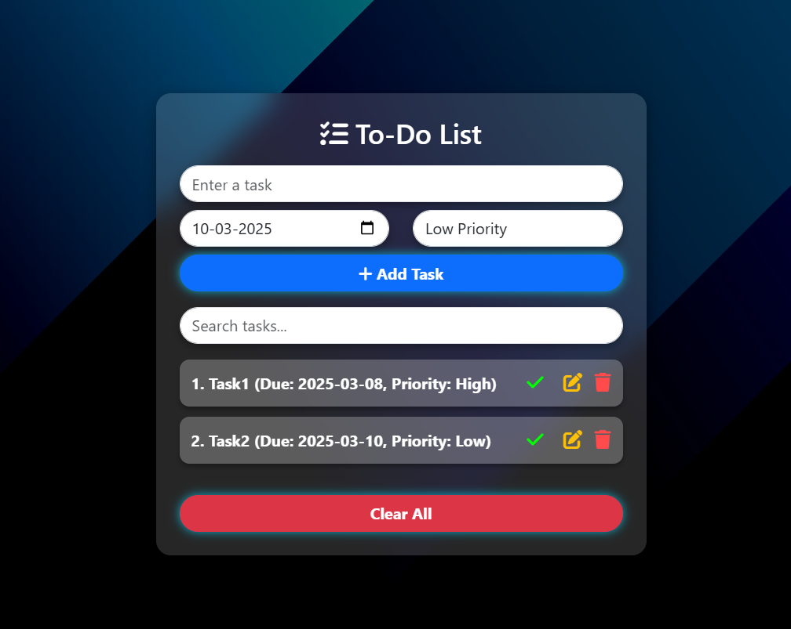

<h1 align ="center">ADVANCED TO-DO LIST</h1>
<h2><a href="https://hyperdevil-x.github.io/Todo_List/" target="_blank">Website Link</a></h2>

 <h3  align ="center"><b>A Advanced To-Do List Using HTML5,CSS3,JAVASCRIPT.BOOTSTRAP V5.3</b></h3>
  

I am thrilled to announce the successful completion of my fully responsive To-Do List project. This project, built using HTML, CSS, JavaScript, and Bootstrap, demonstrates my expertise in front-end development and my ability to integrate essential interactive features effectively.

<ul>
 <h2><b> Key Features </b></h2>
 <li>✅ Add & Manage Tasks – Easily add tasks of any type, including a date and priority level.</li>
 <li>🔍 Real-Time Search – Search for tasks dynamically .</li>
 <li> ✏️ Edit Functionality – Modify any existing task with ease.</li>
 <li>🗑️ Delete Task – Remove specific tasks seamlessly.</li>
 <li>✅❌ Mark as Complete/Incomplete – Toggle task status efficiently.</li>
 <li>🧹 Clear All Tasks – Instantly remove all tasks in one click.</li>
 <li> 💾 Persistent Storage – Tasks are saved in Local Storage, ensuring they remain available even after page refresh.</li>
 
 
 <h1><b> Technologies <b></h1>
<h2><b>Front-End</b></h2>
<li>HTML5</li>
<li>CSS3</li>
<li>JAVASCRIPT</li>
<li>BOOTSTRAP V5.3</li>
</ul>

